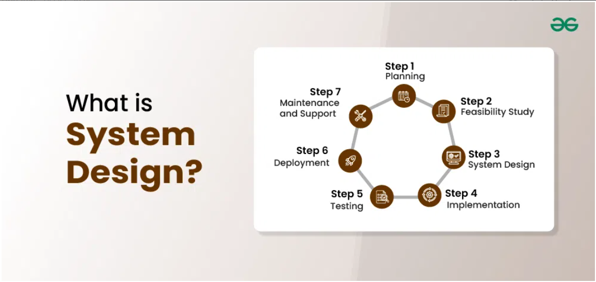
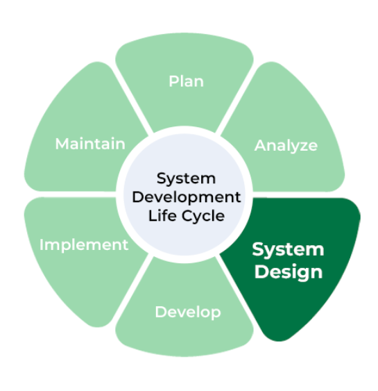
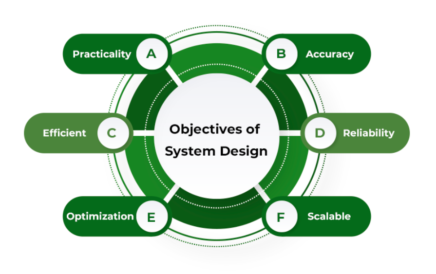
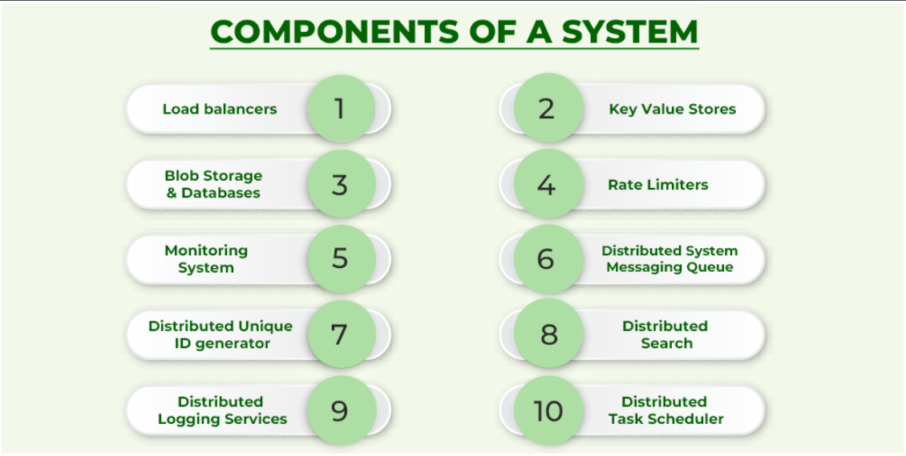
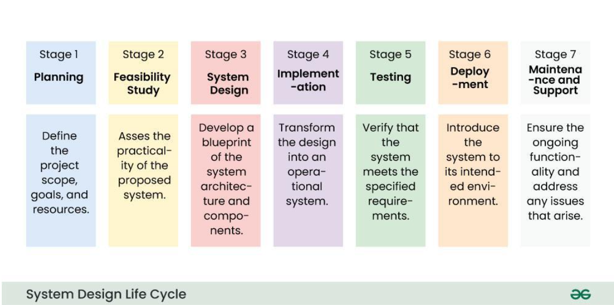
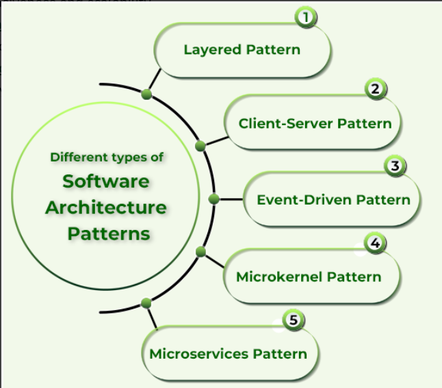
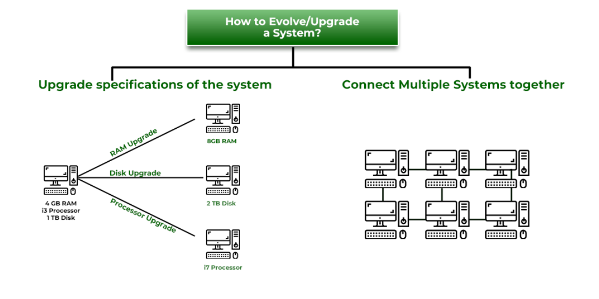
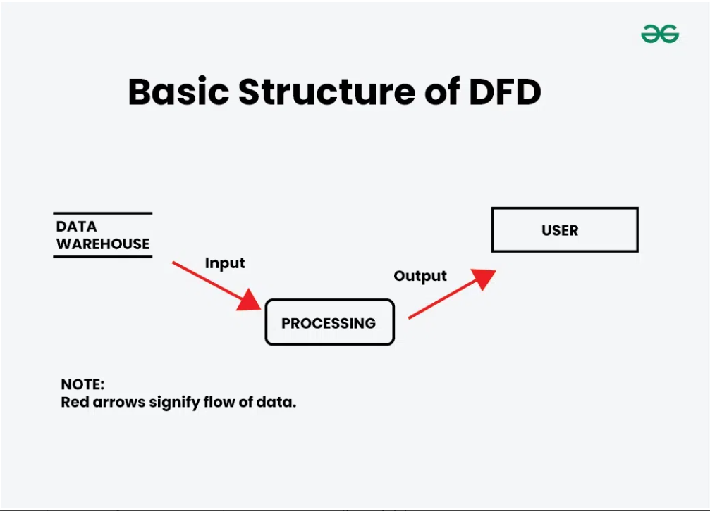

### Introduction
**What is the System Design..?**
Systems Design defines a system's architecture, components, interfaces, and data to meet specific requirements. It translates user needs into a detailed blueprint, ensuring scalability, maintainability, and performance for efficient implementation.

## Why Learn System Design?
System Design is a critical phase in SDLC, serving as the foundation for successful implementation, testing, and system maintenance. It ensures a system’s robustness, scalability, and ability to handle complex scenarios.  

**Reasons:**
1. **Essential for FAANG and Product-Based Companies** – Frequently tested in interviews.  
2. **Senior-Level Roles** – Required expertise for higher positions.  
3. **Job Security** – Demonstrates the ability to create scalable and maintainable solutions.  
4. **Effective Communication** – Bridges technical ideas with teams and stakeholders.  
5. **Improved Decision-Making** – Helps in evaluating trade-offs and designing efficient systems.  

Mastering System Design enhances career prospects and problem-solving skills in tech.

## Objectives of Systems Design

1. **Practicality**  
   - The system should be user-centric, addressing the target audience's specific needs effectively.  

2. **Accuracy**  
   - The design must fulfill both functional and non-functional requirements as closely as possible.  

3. **Completeness**  
   - It should cover all user requirements without leaving any gaps.  

4. **Efficiency**  
   - The system should optimally use resources, balancing cost with performance to ensure high throughput and low latency.  

5. **Reliability**  
   - It should operate in a failure-free environment for a defined period, ensuring consistent performance.  

6. **Optimization**  
   - Time and space efficiency should be considered for all components, just as with code optimization.  

7. **Scalability (Flexibility)**  
   - The design must adapt to evolving user needs and growing demands over time. Scalability is a critical factor for long-term success, as seen in companies like GeeksforGeeks.  

## Advantages of System Design  

System Design brings several benefits, fostering creativity and technical awareness among developers by integrating API protocols, networking, and databases.  

1. **Reduces Design Costs**  
   - Leveraging established design patterns and reusable components minimizes development expenses.  

2. **Accelerates Development**  
   - Frameworks and libraries speed up the process by providing ready-to-use functionalities, allowing developers to focus on unique system features.  

3. **Saves Time in SDLC**  
   - Streamlined workflows and automation shorten the Software Development Life Cycle, ensuring quicker iterations and faster time-to-market.  

4. **Boosts Programmer Efficiency and Consistency**  
   - Familiar tools and methods enable developers to code more effectively, ensuring consistency and reducing errors.  

5. **Optimizes Resource Use**  
   - Efficient design practices save both human and material resources, preventing redundancy and wastage.  

### **Components of Systems Design**  

Below are key components of Systems Design, summarized:  

1. **Load Balancers**  
   - Distribute incoming traffic across multiple servers to optimize performance and ensure system reliability.  

2. **Key-Value Stores**  
   - Store data as key-value pairs, often implemented using distributed hash tables for fast lookups.  

3. **Blob Storage**  
   - Manage large amounts of unstructured data (e.g., media files on platforms like YouTube or Netflix).  

4. **Databases**  
   - Centralized or distributed systems for storing, accessing, managing, and modifying organized collections of data.  

5. **Rate Limiters**  
   - Restrict the number of requests a service can handle in a given time to prevent overload and abuse.  

6. **Monitoring Systems**  
   - Track and analyze infrastructure metrics like CPU usage, memory, and bandwidth to ensure optimal performance.  

7. **Distributed Messaging Queues**  
   - Facilitate reliable communication between producers and consumers, ensuring asynchronous message delivery.  

8. **Distributed Unique ID Generators**  
   - Create unique identifiers for events or tasks in a distributed environment to maintain consistency.  

9. **Distributed Search**  
   - Enable searching across multiple datasets or services for relevant information efficiently.  

10. **Distributed Logging Services**  
    - Collect and trace logs from various services to monitor, debug, and troubleshoot systems effectively.  

11. **Distributed Task Schedulers**  
    - Manage and schedule tasks across a distributed system, optimizing resource allocation and execution.  

### **System Design Life Cycle (SDLC)**  
The **System Design Life Cycle (SDLC)** is a structured process that ensures systems are designed and developed to meet user needs and organizational goals. It focuses on creating systems that are reliable, scalable, and maintainable.  

---

**Phrases:**
1. **Requirement Analysis**  
   - Identifying and understanding user needs and system specifications.  
2. **System Design**  
   - Crafting detailed blueprints for the system architecture, components, and interfaces.  
3. **Implementation**  
   - Translating designs into functional systems through coding or hardware assembly.  
4. **Testing**  
   - Ensuring the system meets requirements and performs reliably.  
5. **Deployment and Maintenance**  
   - Rolling out the system and making iterative updates for performance and scalability.  

---

### **System Architecture**  
**System Architecture** defines the framework for designing and deploying system components. It is the foundational "skeleton" of a software or hardware system, outlining abstraction levels, components, and relationships. It provides a clear representation of the business logic and serves as a guide for both scaling existing systems and designing new ones.  

---

### **System Architecture Patterns**  
**System Architecture Patterns** are predefined ways to organize and structure system components to address specific problems effectively.  

#### **Types of Architecture Patterns:**  
1. **Client-Server Architecture**  
   - Divides the system into clients (requesting services) and servers (providing services).  
   - Example: Web applications where browsers act as clients.  

2. **Event-Driven Architecture**  
   - Components communicate via events, enabling decoupled and scalable systems.  
   - Example: Real-time analytics systems.  

3. **Microkernel Architecture**  
   - Features a lightweight core (microkernel) with plugins or extensions for additional functionalities.  
   - Example: Operating systems like Linux.  

4. **Microservices Architecture**  
   - Breaks applications into small, independent services that can be developed, deployed, and scaled separately.  
   - Example: E-commerce platforms like Amazon.  

### **Modularity and Interfaces in Systems Design**  

Both **modularity** and **interfaces** are fundamental concepts in systems design, allowing flexibility, ease of management, and efficient user interactions.  

#### **1. Modularity**  
Modular design breaks complex systems into smaller, independent modules. This approach allows:
- **Separation of concerns**: Each module can be developed, tested, and maintained independently.
- **Flexibility**: Individual components can be upgraded or replaced without impacting the whole system.
- **Scalability**: New modules can be added to extend system functionality.
  
Example: A car's engine, transmission, and brakes are modules that can be modified independently, making the vehicle more adaptable and manageable.

#### **2. Interfaces**  
Interfaces define the interaction points between users and the system. These include:
- **User interfaces**: Elements like buttons, navigation menus, and forms for user input.
- **System interfaces**: APIs or protocols that allow different systems or modules to communicate.

Effective interfaces:
- Improve **usability** by being intuitive and user-friendly.
- Ensure smooth **data collection** and efficient **navigation**.

Together, modularity and interfaces make systems scalable, maintainable, and easier for users to interact with.

---

### **Evolution/Upgrade/Scaling of an Existing System**  

As systems grow in user base or functionality, scaling becomes essential to prevent system crashes and maintain performance. There are two main types of scaling:

#### **1. Vertical Scaling (Upgrade Specifications)**  
Vertical scaling involves enhancing the existing hardware or system configuration to handle more tasks. This includes:
- **Upgrading the processor** or adding more **RAM** and **disk space**.
- **Limitation**: Vertical scaling improves performance but doesn't always address issues like availability or distributed load.

Example: Increasing the CPU and RAM of a single server to handle more requests.

#### **2. Horizontal Scaling (Distributed Systems)**  
Horizontal scaling involves adding more machines or instances to distribute the workload. This method increases the system's **availability** and **fault tolerance** by:
- **Connecting multiple systems** to work together, allowing the system to handle more traffic.
- **Scaling horizontally** ensures the system can grow indefinitely by simply adding more resources (servers or nodes).

Example: A cloud service like AWS that adds more instances to handle increasing user traffic.

Both vertical and horizontal scaling have their use cases, and combining them often ensures both performance and scalability for growing systems.

### **How Data Flows Between Systems?**  

In system design, **Data Flow Diagrams (DFDs)** are used to represent the flow of data within a system. They provide a clear graphical representation that shows how data moves between different system components. DFDs help in visualizing the partitioning of a system and understanding how different parts interact with each other through data exchanges.

### **Basic Structure of DFD**  
A DFD consists of several components, each representing different aspects of the data flow:

#### **Components of DFD:**

1. **Square (Source/Destination of Data):**  
   - Represents the external entities (sources or destinations) that interact with the system.  
   - **Example:** A user or another system that provides or receives data.

2. **Arrow (Data Flow):**  
   - Shows the direction of data flow. The arrow is a pipeline through which information moves from one entity to another or from one process to another.  
   - **Example:** The flow of data from a user to a process, or from a process to a database.

3. **Circle/Bubble (Process):**  
   - Represents a process or transformation where incoming data is converted into outgoing data.  
   - **Example:** A calculation, data validation, or data processing step in the system.

4. **Open Rectangle (Data Store):**  
   - Represents a data store or a temporary repository where data is held. It shows where data resides during or after processing.  
   - **Example:** A database or a file system where data is stored for later use.

