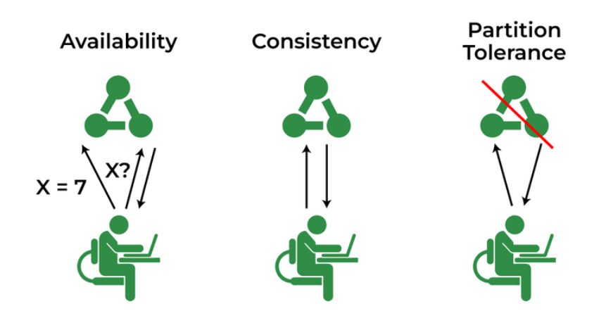

### Key Concepts and Terminologies in System Design  

System design is the foundation of developing robust, distributed systems. It involves creating architectures for system components, interfaces, and modules to fulfill requirements efficiently. Below are essential concepts and terminologies to master in system design:

---

### **1. Throughput**  
**Definition:** The amount of data transmitted successfully in a system over a specific period.  
**Unit:** Bits per second (bps).  
**Example:** Data sent and received between servers in a distributed system.  
- **Optimization:** Increase network bandwidth or minimize resource contention.

   

---

### **2. Latency**  
**Definition:** The time required for data to be delivered from source to destination.  
**Unit:** Milliseconds (ms).  
**Factors Contributing to Latency:**  
- **Network Delays:** Signal transmission time.  
- **Mathematical Calculation Delays:** Processing time on nodes.  
**Formula in Distributed Systems:**  
\[ \text{Latency} = \text{Mathematical Calculation Delays} + \text{Network Delays} \]  

**Techniques to Reduce Latency:**  
- **Use CDNs:** Reduce the physical distance between users and servers.  
- **Caching:** Store frequently accessed data closer to the user.  
- **Hardware Upgrades:** Improve computational efficiency.  
    
    
    

---

### **3. Availability**  
**Definition:** The percentage of time a system is operational and accessible.  
**Measurement:** Based on "nines" (e.g., 99.9% = ~8.7 hours of downtime/year).  

**Improving Availability:**  
- Eliminate Single Points of Failure (SPOF).  
- Implement geographic redundancy.  
- Automate failover processes.  
   
---

### **4. Redundancy**  
**Definition:** Duplication of system components to ensure reliability and reduce downtime.  
- **Example:** Duplicating servers for load distribution.  
**Key Mechanism:** Load balancers distribute traffic to prevent overloading any single server.  

**Handling Load Balancer Failures:**  
- **Backup Load Balancers:** Use secondary balancers with health checks.  
- **DNS-Based Failover:** Leverage DNS for distributing traffic but monitor for failures.  
   
---

### **5. Consistency**  
**Definition:** Uniformity of data across system nodes.  
- **Strong Consistency:** Users always receive the latest data.  
- **Example:** Bank account transactions reflecting real-time balances.  

**Issues with Consistency:**  
- **Dirty Reads:** Occurs when outdated or incorrect data is accessed.  

---

### **6. Time in System Design**  
**Types of Clocks:**  
- **Physical Clock:** Measures time across systems (e.g., time zones).  
- **Logical Clock:** Tracks event sequences within a system.  
**Example:** Synchronizing timestamps for distributed database operations.
   
---

### **7. CAP Theorem**  
**Principle:** In distributed systems, you can achieve only two out of three properties simultaneously:  
- **Consistency (C):** Uniform data availability across nodes.  
- **Availability (A):** System responsiveness at all times.  
- **Partition Tolerance (P):** System continues to function despite network partitions.  

**Trade-offs:**  
- **CA Systems:** High consistency and availability but less fault-tolerant.  
- **AP Systems:** High availability and partition tolerance but eventual consistency.  
- **CP Systems:** Strong consistency and fault tolerance but may compromise availability.  
   
---

### **8. Lamport’s Logical Clock Theorem**  
**Purpose:** Establishes the sequence of events in distributed systems without a global clock.  
- **Developed By:** Leslie Lamport.  
**Applications:**  
- Synchronizing distributed processes.  
- Foundation for Vector Clock algorithms.  
   
