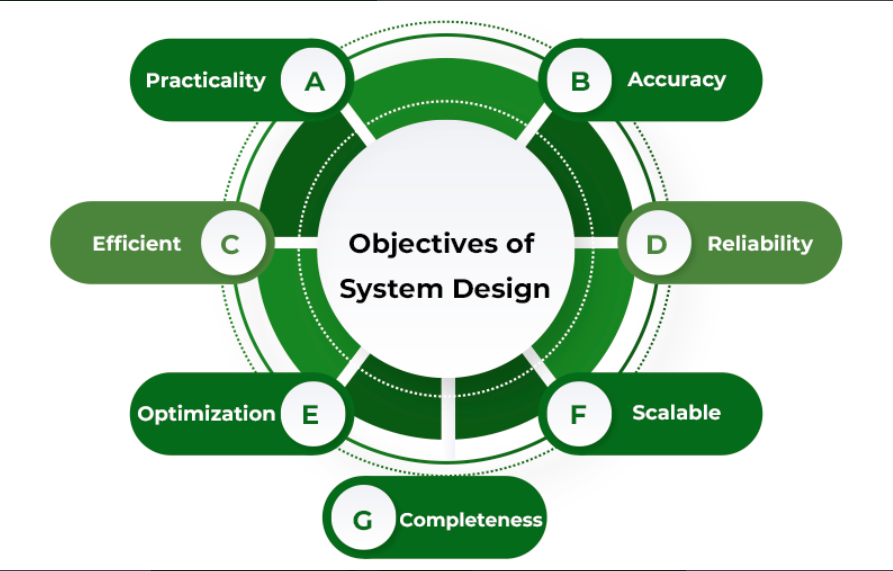

### Goals and Objectives of System Design

System design focuses on creating systems that fulfill specific user requirements while ensuring reliability, efficiency, and scalability. It serves as the foundation for implementing software or hardware solutions, emphasizing planning, optimization, and user-centric design.

---

### **Key Objectives of System Design**

1. **Practicality**
   - Design systems targeting specific audiences and their unique requirements.
   - Ensure the system aligns with real-world use cases and expectations.

2. **Accuracy**
   - Fulfill both functional and non-functional requirements precisely.
   - Minimize errors and gaps between the design and intended outcomes.

3. **Completeness**
   - Address all user requirements comprehensively.
   - Avoid leaving critical features or functionalities unaddressed.

4. **Efficiency**
   - Optimize resource usage to balance cost and performance.
   - Achieve low latency, high throughput, and optimal response times.

5. **Reliability**
   - Design systems to minimize failures and ensure consistent performance.
   - Support long-term stability even under adverse conditions.

6. **Optimization**
   - Optimize time and space utilization for both system and code components.
   - Streamline processes to reduce unnecessary overhead.

7. **Scalability**
   - Ensure the system can adapt to increasing demands and evolving user needs.
   - Build for long-term growth and flexibility, avoiding pitfalls like obsolescence.

   

---

### **System Design Goals and Steps**

#### **Step 1: Identify Requirements**
- **Functional Requirements**:
  - Define core features (e.g., browsing a product catalog, placing orders, payment processing).
- **Non-functional Requirements**:
  - Consider system performance, security, scalability, and reliability.

#### **Step 2: Develop a System Plan**
- Outline the architecture, components, and interfaces.
- Detail algorithms, data structures, and workflows.

#### **Step 3: Ensure Reliability and Efficiency**
- Minimize downtime and errors by robust testing and redundancy.
- Maximize performance through resource optimization and load balancing.

#### **Step 4: Focus on User-Friendliness**
- Create intuitive, clear, and accessible interfaces.
- Prioritize ease of navigation and minimal learning curves for end-users.

#### **Step 5: Address Constraints and Limitations**
- Design within hardware, software, and regulatory constraints.
- Consider compatibility and adherence to standards.

---

### **Example: System Design for a Small E-Commerce Website**

#### **1. Functional Requirements**
- Browse products and view details.
- Add products to a shopping cart and place orders.
- Track order statuses and send notifications.
- Process payments and handle refunds.

#### **2. Non-Functional Requirements**
- Handle high traffic and concurrent users efficiently.
- Provide rapid response times and catalog updates.
- Implement robust security measures to prevent data breaches.

#### **3. High-Level Architecture**
- **Frontend**: Web interface for browsing, ordering, and user interaction.
- **Backend**:
  - Database: Store customer, order, and product information.
  - Microservices: Handle payments, order management, and notifications.
- Communication through APIs.

#### **4. Detailed Architecture**
- **Frontend**: Built using frameworks like React or Angular, interacting with backend APIs.
- **Backend**:
  - Databases (e.g., MySQL, PostgreSQL) for structured storage.
  - Microservices for specific tasks (e.g., using Stripe for payments).
- **Security**: Use HTTPS, authentication, and authorization for data safety.

#### **5. Implementation and Testing**
- Develop and test individual components.
- Integrate and test the system as a whole.
- Deploy on cloud platforms (e.g., AWS, GCP) and monitor for performance.
