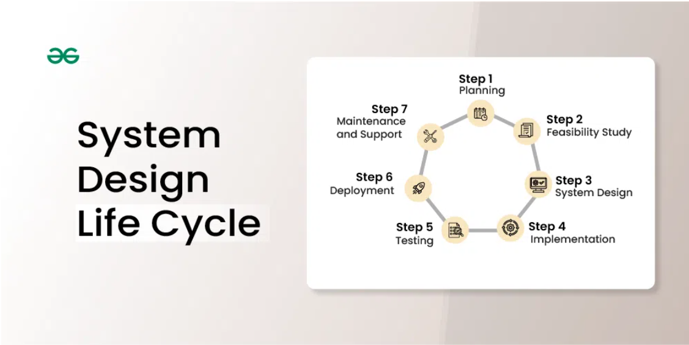
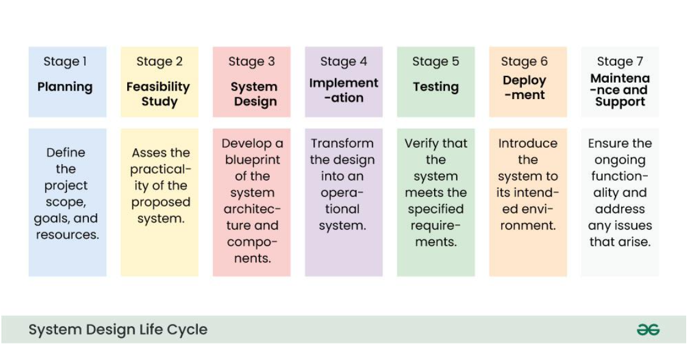

### **System Design Life Cycle Phases**

1. **Planning Stage**  
   - Define goals, scope, and allocate resources.  
   - Example: Initiating a CRM system project by identifying features and team roles.  

2. **Feasibility Study Stage**  
   - Assess technical, operational, and economic viability.  
   - Example: Evaluating if the CRM's benefits justify its costs.  

3. **System Design Stage**  
   - Create detailed blueprints (architecture, UI, database).  
   - Example: Designing user-friendly interfaces and database schema for the CRM.  

4. **Implementation Stage**  
   - Convert design into an operational system.  
   - Example: Writing code and conducting basic tests.  

5. **Testing Stage**  
   - Validate system performance and compliance with requirements.  
   - Example: Running unit and integration tests on the CRM.  

6. **Deployment Stage**  
   - Release the system for use in its environment.  
   - Example: Installing the CRM and training employees.  

7. **Maintenance and Support Stage**  
   - Perform updates, bug fixes, and user support.  
   - Example: Regular patch updates for CRM software.  

   
   
   
---

### **Key Differences: System Development vs. System Design Life Cycle**

| **Aspect**                | **System Development Life Cycle** | **System Design Life Cycle**          |
|---------------------------|-----------------------------------|---------------------------------------|
| **Definition**            | Encompasses all development phases. | Focuses on the design phase.          |
| **Scope**                 | Broad: initiation to retirement.  | Narrow: design aspects.               |
| **Focus**                 | Overall system creation process.  | Blueprinting system construction.     |
| **Purpose**               | Guides the entire lifecycle.      | Details how the system operates.      |

---

### **Challenges in SDLC**

1. Ambiguity in initial requirements.  
2. Evolving user needs during the process.  
3. Rapid tech advancements impacting design choices.  
4. Complexity in component integration.  
5. Budget constraints affecting feature incorporation.  

---

### **Models Used**

1. **Waterfall Model**: Sequential and structured.  
2. **Iterative Model**: Continuous refinements.  
3. **Prototyping Model**: Early feedback via prototypes.  
4. **Spiral Model**: Combines iterative and prototyping aspects.  
5. **Agile Model**: Adaptable with frequent updates.  

---

### **Best Practices**

- Document requirements comprehensively.  
- Foster stakeholder communication.  
- Design modular, scalable systems.  
- Identify and address risks early.  

---

### **Use Cases**

- New software development.  
- Legacy system replacement.  
- Integration of systems.  
- Tailored business solutions.  

This holistic SDLC approach ensures systems are effective, scalable, and sustainable.