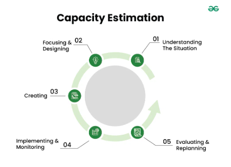

### **Capacity Estimation in Systems Design**  

**Definition:**  
Capacity estimation predicts how much load a system can handle before performance degrades. It ensures scalability and prevents failures.  

### **Key Factors Affecting Capacity**  
- **Hardware Resources** (CPU, RAM, Storage)  
- **Software Efficiency** (Optimized algorithms, database queries)  
- **Workload Characteristics** (Traffic patterns, peak load)  
- **User Behavior** (Concurrent users, request rates)  
- **Scalability** (Vertical vs. horizontal scaling)  
- **Failure Scenarios** (Fault tolerance, redundancy)  

### **Important Metrics**  
- **Daily Active Users (DAU)** – Total unique users per day  
- **Queries Per Second (QPS)** – Requests processed per second  
- **Storage Requirements** – Data volume growth  
- **Error Rates** – Percentage of failed requests  
- **Response Time** – Time taken per request  
- **Concurrency** – Number of simultaneous users  

### **Estimation Methods & Techniques**  
- **Traffic Analysis & Forecasting** – Studying trends & predicting future load  
- **Stress & Load Testing** – Simulating peak usage  
- **Historical Data Analysis** – Using past usage trends  
- **Capacity Planning Tools** – Monitoring resource utilization  

### **Component-wise Capacity Estimation**  
- **CPU & Memory** – Processing power, RAM usage  
- **Storage** – Data growth & retention needs  
- **Network Bandwidth** – Peak traffic handling  
- **Database Resources** – Query load & concurrency  

### **Case Study: E-Commerce Black Friday Sale**  
- **Estimate DAU:** 200,000 users  
- **QPS:** 18.52 requests/sec  
- **Storage Needs:** 1 TB/day  
- **Concurrent Users:** 50,000 (25% of DAU)  
- **Testing:** Load testing (Apache JMeter), stress testing (250,000 users)  
- **Scaling:** Adding servers, optimizing caching  

### **Challenges & Considerations**  
- Dynamic workload changes  
- Unpredictable growth patterns  
- Hardware/software limitations  
- User behavior variability  

### **Best Practices**  
- Start early in system design  
- Collect accurate data  
- Plan for scalability (horizontal/vertical scaling)  
- Regularly update estimates based on trends  

### **Tools for Capacity Estimation**  
- **Load Testing:** Apache JMeter, LoadRunner, Gatling  
- **Monitoring:** Grafana, Prometheus, Datadog  

