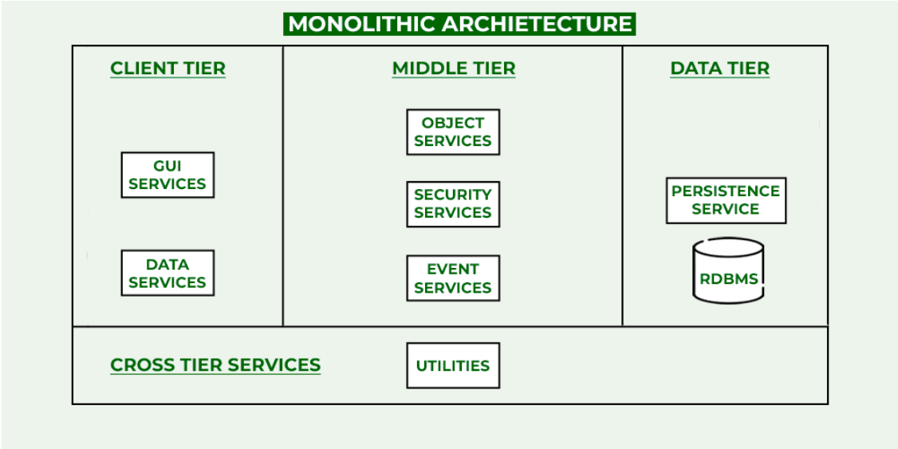
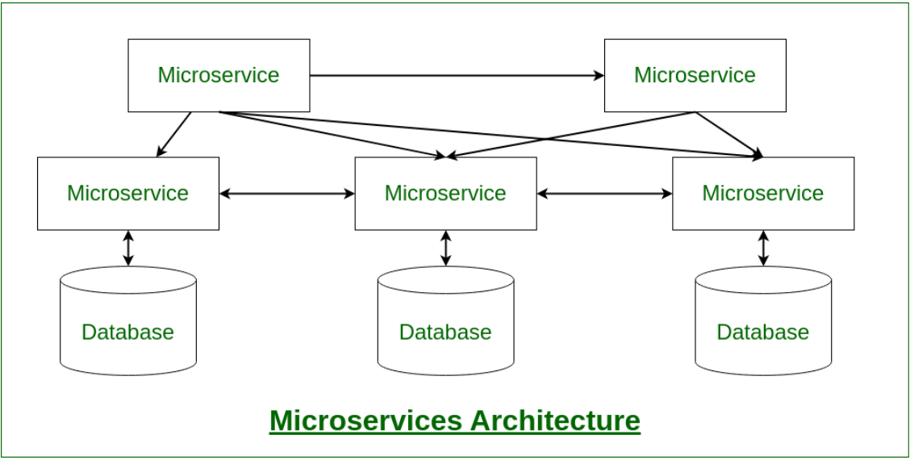
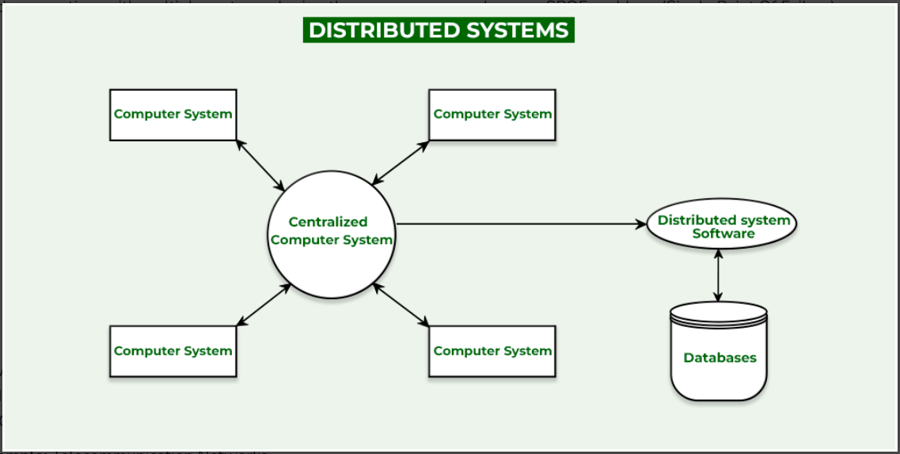
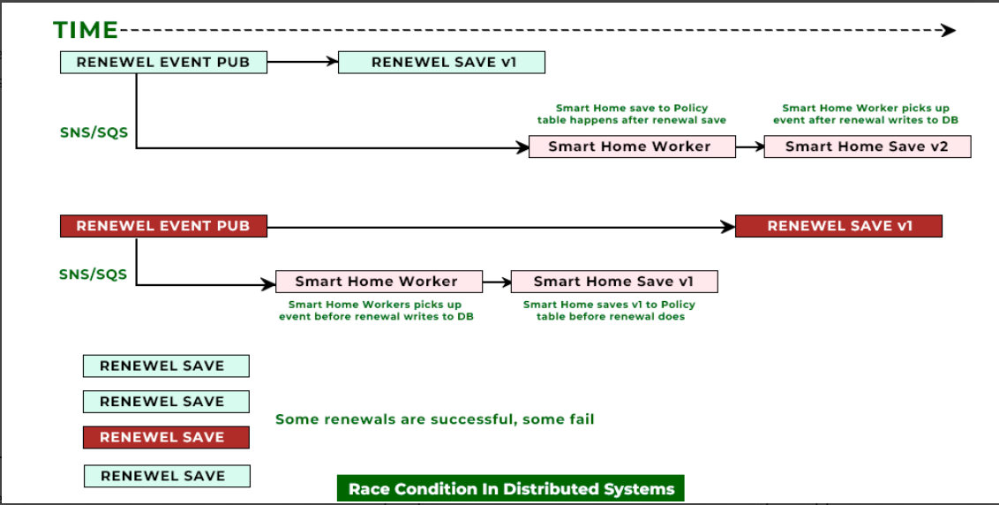

### Monolithic and Distributed Systems
This article provides an in-depth comparative analysis of **Monolithic and Distributed Systems** in the context of system design, touching upon their architecture, benefits, disadvantages, and associated challenges like race conditions. Below is a structured summary of key points covered in the article:

---

### **System Analysis vs System Design**
- **System Analysis:** Focuses on gathering functional and non-functional requirements, identifying business logic, and ensuring error removal in an existing model.
- **System Design:** Involves creating or updating business logic, planning architecture, and dealing with errors as they occur.

| **Parameters**       | **System Analysis**                            | **System Design**                     |
|-----------------------|-----------------------------------------------|---------------------------------------|
| **Time**             | Shorter                                      | Longer                               |
| **Process**          | Long but simple                              | Short but complex                    |
| **Configurations**   | Requires high system configurations          | Low configurations for smaller tasks |
| **Focus**            | Fixing errors                                | Managing errors post-deployment      |
| **Programmer Role**  | Field-specific expertise                     | Broad conceptual knowledge           |

---

### **Types of Systems in Design**
#### 1. **Monolithic Systems**
- **Definition:** A single-unit application where all functionalities exist within one codebase.
- **Architecture:**
  - **Client Tier (Presentation Layer):** Front-end for user interaction.
  - **Middle Tier (Service Layer):** Business logic and request handling.
  - **Data Tier (Persistence Layer):** Database and messaging mechanisms.

- **Advantages:**
  - Easy development, deployment, and testing.
  - Ideal for small-scale applications and startups.
  
- **Disadvantages:**
  - Limited scalability.
  - Difficult to update and maintain as it grows.
  - High coupling leads to challenges in modular updates.
     

#### 2. **Distributed Systems (Including Microservices)**
- **Definition:** A collection of independent systems (nodes) connected via a network, designed for modularity and scalability.

- **Microservices:**
  - Applications split into smaller, independent services communicating via lightweight protocols (e.g., HTTP).
  - **Key Benefits:**
    - Scalability and flexibility.
    - Resilience and technology heterogeneity.
  - **Challenges:**
    - Testing complexity and network overhead.
    - Requires skilled developers familiar with distributed design.
       
    

- **Distributed Systems:** 
  - A broader implementation involving geographically dispersed systems to share resources and achieve high scalability and reliability.
  - **Advantages:**
    - Scalability through horizontal scaling.
    - Reliability via redundancy and replication.
    - Low latency by proximity to users.
  - **Disadvantages:**
    - Complexity in integration and synchronization.
    - Vulnerability to network failures.
   

---

### **Race Conditions**
- **Definition:** A bug caused by timing mismatches in execution orders, often in distributed systems where parallelism exists.
- **Examples:** Banking systems where validation logic for processes (e.g., credit card approval) faces conflicting parallel requests.

**Solutions to Handle Race Conditions:**
1. **Simple Approach:** Combine validation and change requests into one operation.
2. **Advanced Approach:** Refactor validation logic into dedicated services, ensuring parallelism is managed efficiently.
   

---

### **Summary**
- Monolithic systems are suitable for simpler, smaller applications, particularly for startups, due to ease of handling and deployment.
- Distributed systems, especially those based on microservices, offer scalability and reliability for larger, complex applications but come with higher complexity and operational overhead.
- Addressing challenges like race conditions and maintaining system performance requires strategic design and development practices.

Would you like further details on any specific section, such as implementation examples or tools for designing these architectures?