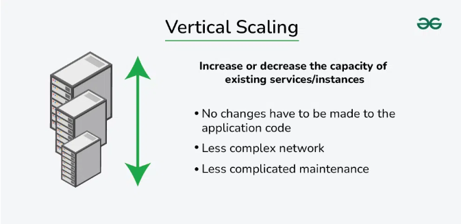
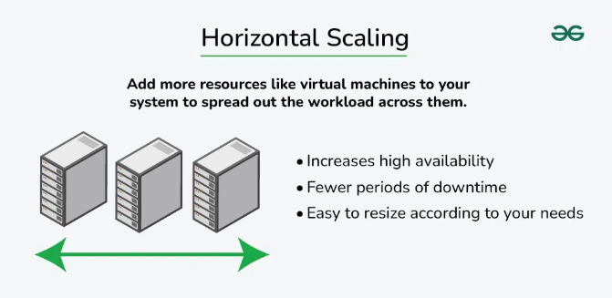

### **Horizontal vs. Vertical Scaling – System Design**  

**Scalability** refers to a system’s ability to handle increasing workloads efficiently. It is crucial in system design to maintain performance and prevent bottlenecks. The two main types of scaling are:  

### **1. Vertical Scaling (Scale-Up)**  
- Involves upgrading a single server’s resources (CPU, RAM, storage).  
- Simple to implement, no changes in system architecture.  
- **Pros:** Easy management, maintains application compatibility.  
- **Cons:** Limited by hardware constraints, costly, single point of failure.  
- **Examples:** MySQL, Amazon RDS.  

     

### **2. Horizontal Scaling (Scale-Out)**  
- Increases capacity by adding more servers to distribute the load.  
- Supports high availability and failover.  
- **Pros:** Improved fault tolerance, better performance, cost-effective for large-scale systems.  
- **Cons:** Complex management, requires load balancing.  
- **Examples:** Google, Facebook, MongoDB, Cassandra.  

     

### **Key Differences**  
| Aspect | Horizontal Scaling | Vertical Scaling |  
|--------|------------------|----------------|  
| **Resource Addition** | Adds more servers | Enhances a single server |  
| **Cost** | Cost-effective long-term | Becomes expensive over time |  
| **Fault Tolerance** | High due to distributed workload | Low, as failure affects the system |  
| **Performance** | Scales by adding machines | Limited by hardware capacity |  
| **Complexity** | Requires distributed system management | Easier to manage |  

### **Choosing the Right Approach**  
- **Use Vertical Scaling** for applications needing high processing power on a single machine.  
- **Use Horizontal Scaling** for applications requiring redundancy, scalability, and high availability.  
- **Hybrid Approach** combines both for optimal performance and resilience.